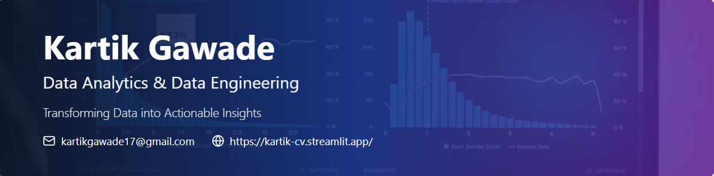

# 💫 About Me:
I am passionate about leveraging data to solve real-world problems and build intelligent systems. Currently pursuing my M.Sc. in Artificial Intelligence, I am actively developing skills in: Data Analytics Data Engineering Machine Learning & Deep Learning Python Development I enjoy working on data-driven projects, building end-to-end solutions, and continuously improving my technical expertise.

## 🌐 Socials:
   

# 💻 Tech Stack:
                
# 📊 GitHub Stats:
 
 

---

<!-- Proudly created with GPRM ( https://gprm.itsvg.in ) -->

# Hi, I'm Kartik Gawade

I am passionate about leveraging data to solve real-world problems and build intelligent systems.  
Currently pursuing my **M.Sc. in Artificial Intelligence**, I am actively developing skills in:

- Data Analytics  
- Data Engineering  
- Machine Learning & Deep Learning  
- Python Development  

I enjoy working on data-driven projects, building end-to-end solutions, and continuously improving my technical expertise.

### Academic & Certification Highlights
- Pursuing **Master of Science in Artificial Intelligence**  
- Completed **Microsoft Azure DP-900: Azure Data Fundamentals** with a score of **835/1000**  

### Contact
If you'd like to collaborate or discuss anything related to data or AI, feel free to reach out:  
**Email:** kartikgawade17@gmail.com

